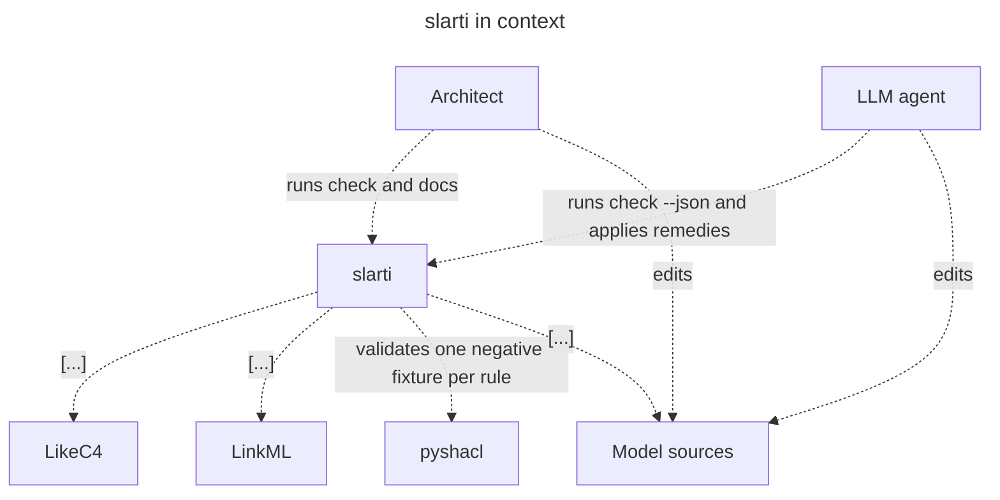
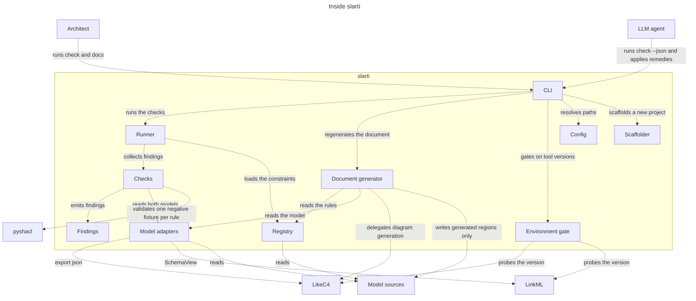

# slarti — architecture

This document is generated in part by `slarti` itself (I13). The prose is
user-authored; every region between `slarti:begin` / `slarti:end` markers is
generated from `model/` and must never be hand-edited.

## 1. Introduction and goals

Architecture documents drift, and the drift is invisible: a stale diagram looks
exactly like a fresh one, and an unenforced rule in prose reads exactly like an
enforced one.

**LikeC4** validates structure and generates diagrams. **LinkML** validates
entities and generates schemas and projections. Neither can see the other, and
neither can see the prose document that claims what they enforce. `slarti` owns
exactly those joins:

- LikeC4 ↔ LinkML — the ownership seam.
- Document ↔ rules — the constraint registry.
- Document ↔ models — the drift gate.

Everything else — parsing, validating, rendering, generating — is delegated to
LikeC4, LinkML and pyshacl as subprocesses.

## 2. Constraints

- Python 3.11+, distributed as a `uv`-installable CLI.
- Exactly two backends: LikeC4 and LinkML. No abstraction layer over either.
- No cache and no state file: everything is derived on each invocation.
- No JVM, no Docker and no browser on the default path.
- Supported ranges are enforced at runtime: LikeC4 `>=1.59,<2`, LinkML
  `>=1.11,<2`, Node `>=20`, Python `>=3.11,<4`. Outside the range `slarti`
  refuses to run rather than producing possibly-wrong output.

## 3. Context

The people who use `slarti`, the sources they edit, and the tools it delegates to.

<!-- slarti:begin diagram:index -->

<!-- slarti:end diagram:index -->

## 4. Building block view

Inside `slarti`: the CLI gates on the environment, the runner orders the checks,
the adapters are the only components that talk to LikeC4 and LinkML, and the
document generator is the only component that writes.

<!-- slarti:begin diagram:containers -->

<!-- slarti:end diagram:containers -->

## 5. The ownership seam

Every entity in the schema names the container that owns it, and every container
claims its entities back. Both directions are checked (`OWN-1`..`OWN-5`), because
a dangling pointer and an unclaimed target are different failures.

<!-- slarti:begin ownership -->

| Entity | Owner | Owner title |
| --- | --- | --- |
| Constraint | `slarti.registry` | Registry |
| Element | `slarti.models` | Model adapters |
| Enforcer | `slarti.registry` | Registry |
| Finding | `slarti.findings` | Findings |
| Probe | `slarti.env` | Environment gate |
| ProjectPaths | `slarti.settings` | Config |
| Region | `slarti.docsgen` | Document generator |
| Relation | `slarti.models` | Model adapters |
| Report | `slarti.findings` | Findings |

<!-- slarti:end ownership -->

## 6. Enforced rules

Each rule below points at an enforcer that `slarti` resolves against the models on
every run. If the enforcer disappears, the rule becomes a `REG-1` finding rather
than a sentence that quietly stops being true.

<!-- slarti:begin constraints -->

| ID | Rule | Layer | Enforced by | Decision |
| --- | --- | --- | --- | --- |
| D1 | Every finding carries a stable rule ID and a remedy sentence. | 3 | shacl_shape `slarti:FindingCarriesRemedy` | ADR-0002 |
| D2 | A constraint with no enforcer must give a reason. | 3 | shacl_shape `slarti:UnenforcedConstraintGivesReason` | ADR-0002 |
| D3 | An enforcer names the thing that enforces the rule. | 3 | shacl_shape `slarti:EnforcerNamesWhatItIs` | - |
| D4 | A finding names the file it is about. | 2 | linkml_slot `Finding.file` | - |
| D5 | The checks never invoke LikeC4 or LinkML themselves; the adapters do. | 1 | likec4_absent_relation `slarti.checks -> likec4` | - |
| D6 | The CLI never reads model sources directly; it goes through the adapters. | 1 | likec4_absent_relation `slarti.cli -> sources` | - |
| D7 | The environment gate probes LikeC4 before any command that shells out. | 1 | likec4_relation `slarti.env -> likec4` | - |
| D8 | Every domain entity is owned by exactly one container. | 1 | ownership `Finding` | ADR-0002 |
| D9 | The document generator writes only generated regions of the sources. | 1 | likec4_relation `slarti.docsgen -> sources` | - |

<!-- slarti:end constraints -->

## 7. Unverified invariants

Rules that are stated but not mechanically enforced. This table is the honest
case, not a failure: each entry must say why enforcement is not possible.

<!-- slarti:begin unverified -->

| ID | Rule | Why unenforced |
| --- | --- | --- |
| U1 | slarti never modifies a user-authored file. | Layer 1 can say which container writes to the sources, not that the write touched only a generated region. Verified instead by a test that hashes every user-authored file before and after each command. |
| U2 | Running a delegated tool directly produces the same result as running it via slarti. | No model can assert that a subprocess was passed through unaltered. Verified by a test asserting byte-identical diagnostics. |
| U3 | Generation is idempotent — running slarti docs twice produces identical output. | Idempotence is a property of a run, not of the model. Verified by a test that hashes the tree across two runs. |

<!-- slarti:end unverified -->

## 8. Decisions

- **ADR-0001 — Python project.** See `docs/adr/0001-python-project.md`.
- **ADR-0002 — Findings are the interface.** See
  `docs/adr/0002-findings-are-the-interface.md`. Findings, not exit codes, are how
  `slarti` speaks to both humans and agents. Every finding carries a stable rule
  ID, a file, a subject phrased in domain terms, and a remedy sentence; the same
  findings render as text or as JSON. Entities in the registry and the schema are
  shaped around that contract, which is why `Finding`, `Constraint` and `Enforcer`
  are modelled entities with shapes over them.

## 9. Risks and technical debt

- Upstream churn in LikeC4's JSON export or LinkML's generators would produce
  wrong findings. Mitigated by a hard version ceiling and a loud refusal to run.
- The registry becomes busywork if it ever stops generating these tables.
- YAML fixtures require a declared `fixture_class` to be converted to RDF;
  Turtle fixtures need nothing. Both are accepted.
